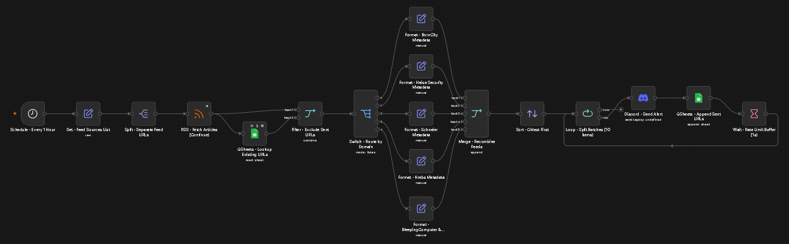
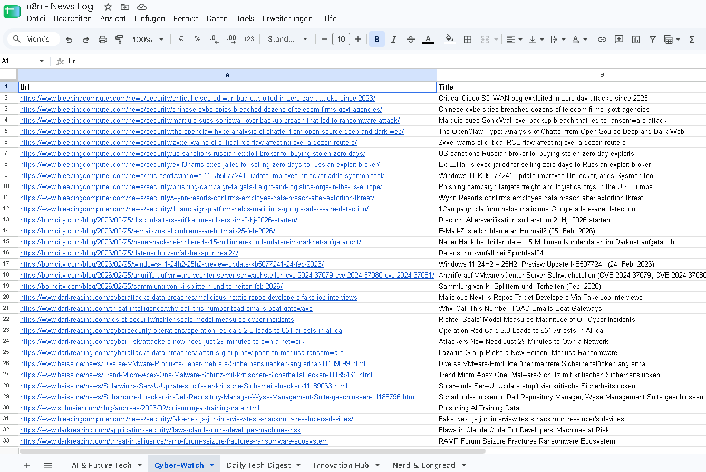

# n8n-automation-flows
## 🛡️ Cyber-Watch: Automated Cybersecurity Feed for Discord (n8n Workflow)

An automated **n8n workflow** that aggregates leading IT security blogs on an hourly basis, filters out duplicates using a Google Sheet, normalizes source metadata, and sends structured alerts to Discord — so you (and your team/community) hear about new vulnerabilities as soon as they're published.

Two versions are available in this repo:

| Version | Sources | Discord message language |
|---|---|---|
| 🇩🇪 `Cyber-Watch (de).json` | BleepingComputer, BornCity, Dark Reading, Heise Security, Krebs on Security, Schneier on Security | German (`Autor`, `Veröffentlicht`) |
| 🇬🇧 `Cyber-Watch (en).json` | BleepingComputer, Dark Reading, Krebs on Security, Schneier on Security | English (`Author`, `Published`) |

The English version excludes the two German-language-only sources (Heise Security and BornCity/Günther Born) since their content wouldn't be relevant for an English-speaking audience.

### Preview

This is what an alert looks like in Discord:

.png)

---

## 🚀 Features

- **Hourly Monitoring:** Watches BleepingComputer, BornCity, Dark Reading, Heise Security, Krebs on Security, and Schneier on Security (source list depends on version, see table above).
- **Fault-tolerant (`Continue on Fail`):** Prevents the entire workflow from failing if a single source feed is temporarily unreachable.
- **Smart Deduplication:** Compares article URLs against a Google Sheet database to avoid sending duplicate notifications.
- **Metadata Normalization:** Cleans up inconsistent RSS formats (author fields, RFC 2822 & ISO date formats).
- **Chronological Order:** Sorts older articles first, so the timeline in the Discord channel stays consistent.
- **Rate-Limit Protection:** Sends alerts in batches of 10 with a delay between batches (helpful after restarts or downtime, when many articles queue up at once).

---

## 🧩 Workflow Overview

---

## 📋 Setup & Requirements

### 1. Prepare the Google Sheet

1. Create a new Google Sheet (e.g. named `Cyber-Watch`).
2. Name the sheet/tab `Cyber-Watch` as well.
3. In **row 1**, add exactly these two column headers:
   - **Column A:** `Url`
   - **Column B:** `Title`

### 2. Import & configure the workflow in n8n

1. Download the workflow file for your preferred language (`Cyber-Watch (de).json` or `Cyber-Watch (en).json`) and import it into n8n (`Workflows` → `Import from File`).
2. **Connect your Google Sheets credentials:**
   - Open the node `GSheets - Lookup Existing URLs`.
   - Under **Credential**, select your Google Sheets OAuth2 connection.
   - Under **Document**, select your prepared Google Sheet.
   - Repeat this for the node `GSheets - Append Sent URLs`. *(Note: the column mappings for `Url` and `Title` are preserved automatically.)*
3. **Connect the Discord webhook:**
   - Open the node `Discord - Send Alert`.
   - Under **Credential for Discord Webhook**, select your existing connection (or create a new one using your webhook URL).
4. **Activate the workflow:** Toggle the switch in the top right to **Active**.

---

## 📝 License & Notes

Free to use and adapt. The Discord node can be swapped out for Slack, Telegram, or Microsoft Teams if you prefer a different notification channel.

← [Back to the main overview of all workflows](../../README.md)
